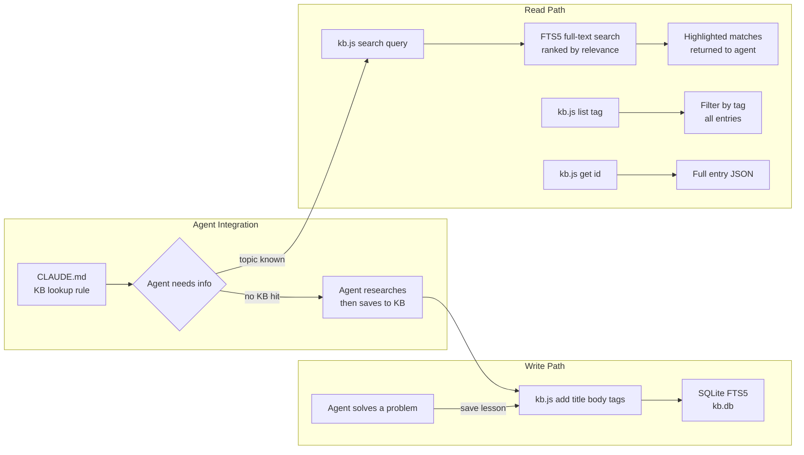
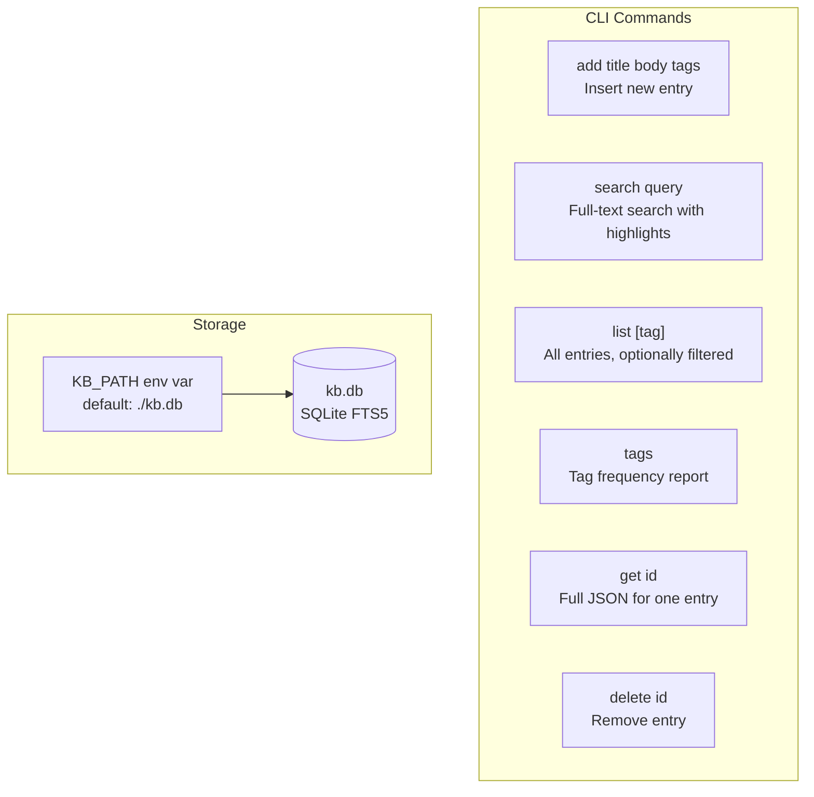

# agent-knowledge-base

SQLite FTS5 knowledge base for Claude Code agents. Stores domain-specific facts with full-text search — faster and more precise than semantic memory for exact command recall, setup procedures, and error solutions.

> Part of [The Agent Crafting Table](https://github.com/Agent-Crafting-Table) — standalone Claude Code agent components.

## How It Works





## Why

Session memory is recent-only. This gives you a persistent, structured reference library that survives restarts, model switches, and context resets — and returns exact matches instead of paraphrases.

## Setup

```bash
npm install
# or: bun install
```

```bash
# Optional: set a custom DB path
export KB_PATH=/workspace/data/my-agent.db
```

## Usage

```bash
node kb.js add "SSH to prod" "ssh root@192.168.1.133 -i ~/.ssh/prod_key" "ssh,infrastructure"
node kb.js add "Fix merge conflict" "git checkout --theirs . && git add . && git rebase --continue" "git,lesson"

node kb.js search "ssh prod"
# [1] SSH to prod (ssh,infrastructure)
#     ...ssh root@>>> 192.168.1.133 <<< -i ~/.ssh/prod_key...

node kb.js list                  # all entries
node kb.js list infrastructure   # filter by tag
node kb.js tags                  # tag frequency
node kb.js get 1                 # full entry JSON
node kb.js delete 1
```

## How agents use it

Add to your `CLAUDE.md`:

```markdown
**KB lookup**: Before answering about prior setup, run `node scripts/kb.js search "<topic>"`.
**Save lessons**: When you solve a non-obvious problem, run `node scripts/kb.js add "title" "solution" "tags"`.
```

## Environment

| Var | Default | Description |
|-----|---------|-------------|
| `KB_PATH` | `./kb.db` | Path to the SQLite database file |
